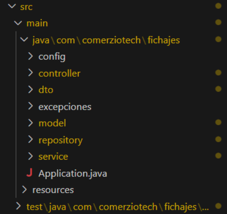
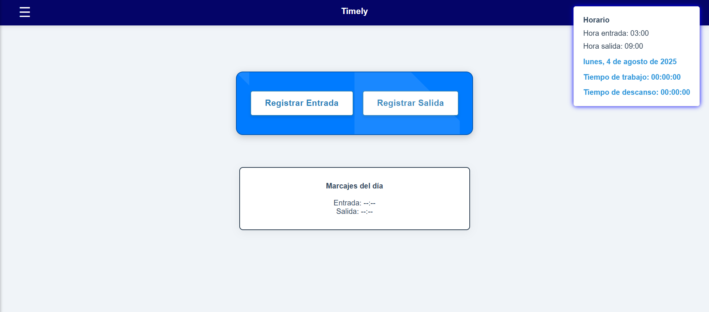
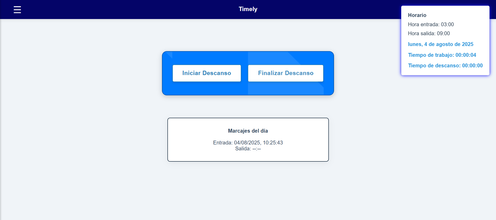
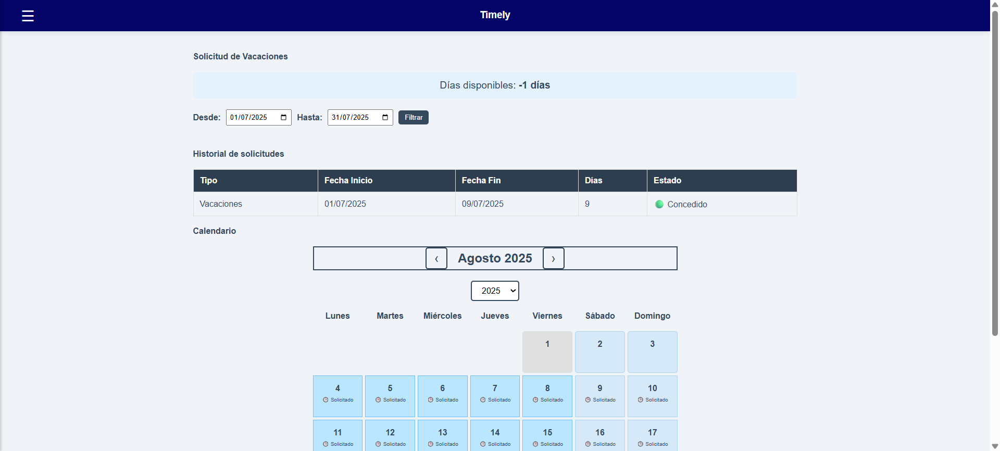
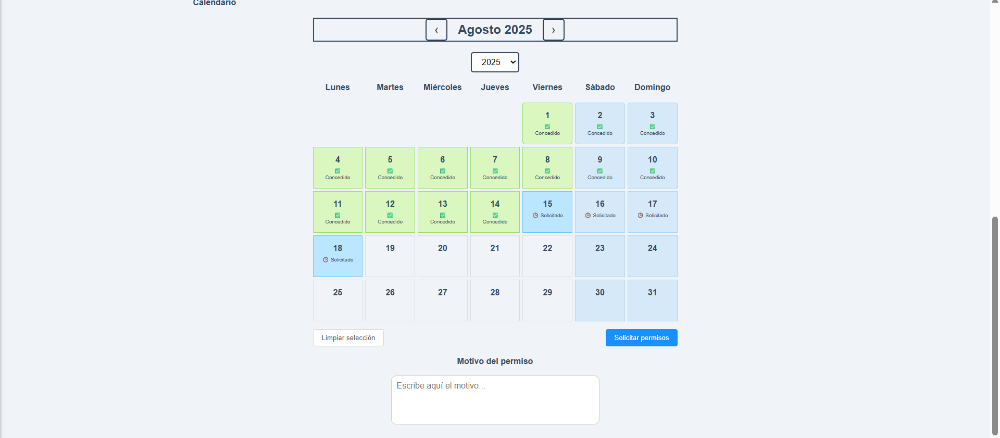
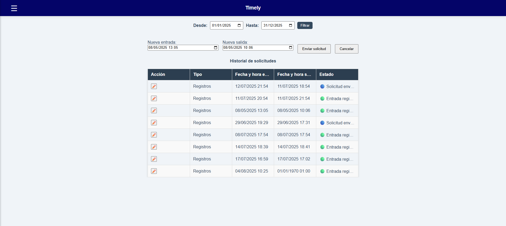
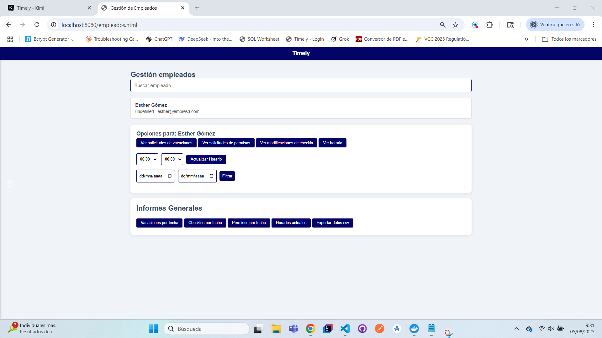
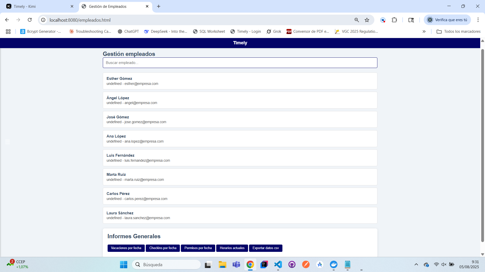
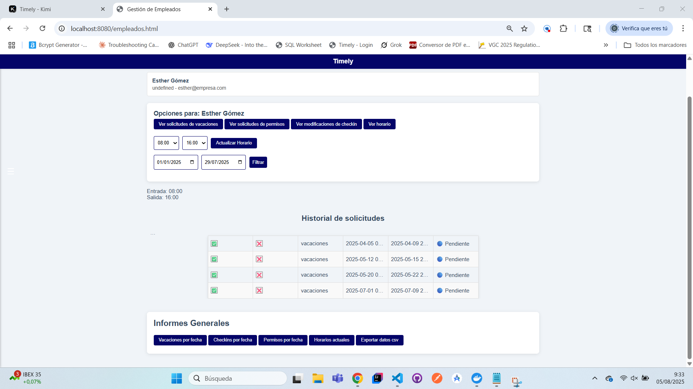

# 🏷️ TIMELY

## 📌 Description  
Timely is a web platform for **HR management**. It allows employees to log their work hours and breaks, request vacations or permissions, and submit entry/exit modifications.  
It features a **role-based system**:  
- 👤 **Employees**: Register attendance, request vacations or modifications.  
- 👨‍💼 **Managers**: Approve/reject requests, view employee stats.  
- 🛡️ **Admin**: Manage companies and employees for security purposes.  

---

## 🛠️ Tech Stack  
- **Java 17**  
- **Spring Boot 3.4.3** (REST API, Security, JPA)  
- **MariaDB**  
- **Maven**  
- **Lombok**, **OpenCSV**  
- **JUnit & Mockito** (Testing)  

---

## 🚀 Key Features  
- 👥 HR Management Actions (attendance, vacations, permissions)  
- 📊 Reports & Statistics for managers  
- 🔒 Secure Authentication (Spring Security & JWT)  

---

## 📂 Project Structure  

 

---

## 🔑 Recruiter Access  

This is a **private repository**.  
If you'd like to review the code, please contact me via **[LinkedIn](https://www.linkedin.com/in/daniel-l-052731375/)** or email at **daniel.lopgon.4@gmail.com** and I will grant temporary access.  

---

## 🖼️ Screenshots

### 🔑 Login Screen  
On this screen, you need to log in. Depending on your role, you will be redirected to the corresponding home screen.  

---

### 👥 Employees Screen  
Here you can register your check-in, check-out, and breaks. Your assigned work schedule is also displayed.  
This screen is designed to be **simple and user-friendly** to minimize errors.  

---

### 🔘 Dynamic Buttons  
The check-in and check-out buttons are dynamic:  
- After checking in, the buttons change to allow starting or ending breaks.  
- Once a break is finished, you can either start another break or check out.  

This design ensures **simplicity and a clean UI**.  

---

### 🌴 Vacation Request Page  
- Displays a **history of vacation requests** with start and end dates.  
- Approved requests are shown in **green**, while pending ones appear in **blue**.  
- Requests are sent to managers, who can approve or reject them.  
- Includes a **calendar view** where granted or pending vacations are visually displayed.  

To request a vacation, simply select the start and end date directly on the calendar.  

---

### 📝 Permission Request Page  
Similar to the vacation request page but includes an additional field for the **reason for the request**.  
In the future, it could differentiate between **paid and unpaid permissions**.  

---

### ⏱️ Check-in Modification Page  
Here, employees can:  
- Edit their check-in or check-out times.  
- Adjust break times.  
- Add missing entries if they forgot to check in.
  

---

###  👨‍💼 Manager Interface

The Manager Interface provides a comprehensive platform for employee management.
From this page, you can:

Search for employees by name or email.
**Approve or reject vacation requests, permissions, and check-in/check-out modifications.**
**View aggregated reports of your employees' activity and export them in CSV format for further analysis.**

Below are some examples of the interface:

### Employee Selection

### Dashboard Overview

### Approve or Reject Requests

---

